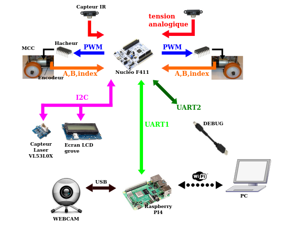

# Projet Robot

## Modes de fonctionnement à programmer pour le robot

- **Mode Manuel** : Permet le contrôle à distance de la direction et de la vitesse de déplacement du robot, avec détection des obstacles.
- **Mode Aléatoire** : Le robot se déplace librement en changeant régulièrement de direction, tout en détectant et en évitant les obstacles.
- **Mode Suivi (Tracking)** : Le robot suit une cible de couleur détectée par la caméra.

## Composants utilisés dans ce projet

- **STM32 Nucleo F411** : Responsable de la gestion de la commande des moteurs en boucle fermée, l'acquisition des données des capteurs de distance, l'affichage sur l'écran LCD (mode de fonctionnement : 'Manuel/Aléatoire/Suivi') et la communication avec le Raspberry Pi.
  
- **Raspberry Pi** : Permet l'acquisition et le traitement de l'image via la Webcam et communique avec le PC par WiFi.

- **IHM (Interface Homme-Machine)** :  
  - Sélection du mode de fonctionnement (Manuel, Aléatoire, Suivi).
  - Envoi de la vitesse souhaitée en m/s.
  - Affichage des vitesses des roues (droite et gauche) en tr/min.
  - Affichage de la vitesse de déplacement en m/s et km/h.
  - Indication de la présence ou non d'obstacles.
  - Commandes de direction : Avancer, Reculer, Gauche, Droite, Stop.
  - Flux vidéo en temps réel depuis la Webcam.

## Schéma général du projet

Voici une vue d'ensemble des composants et des connexions du projet :  

